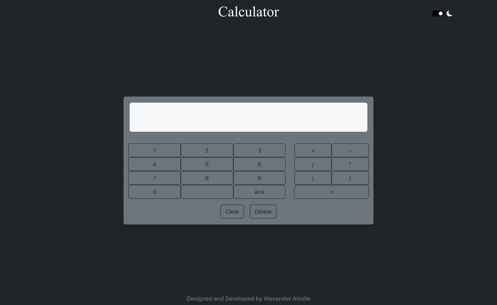
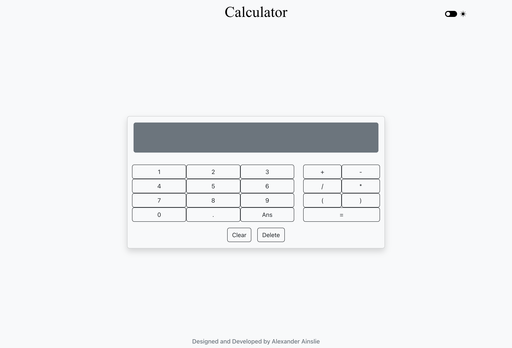

# Calculator

     

## Description

Here is a simple calculator made with React and Bootstrap, which has a light and dark mode.

## Table of Content
* [Preview](#preview)
* [Technologies Used](#technologies-used)
* [License](#license)
* [Questions](#questions)
* [Deployed Application](#deployed-application)

## Preview

## Technologies Used
* React V18.2.0
* Bootstrap V5.2.3
* Node.JS V19.6.0
* NPM V9.4.0

## License
Distributed under the MIT License.

Please see https://opensource.org/licenses/MIT to find out more.

## Questions
If you have any questions, Please contact me through:
* GitHub: [AlexAins](https://github.com/AlexAins)

## Deployed Application

Link to deployed webpage: https://calculator-react-apps.netlify.app/